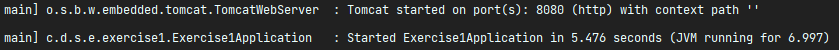
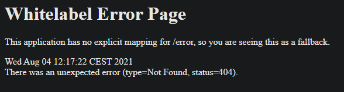
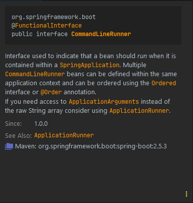
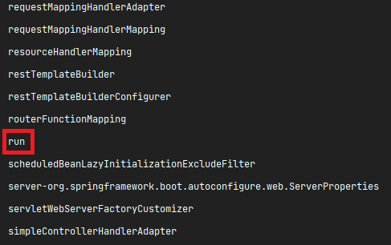

# The IoC container

In this exercise, we'll be creating a few components and inject it in our IoC container, so we can
use them in our application.

Don't worry much about all the annotations used here, as they'll be more detailed taught along this
module. The same applies for the concepts of **Dependency Injection** and **Beans** - you're seeing
them here already, but they'll be further explained later!

## Task 1

The **Exercise1Application** class is our starting point here. That's where you run your Spring Boot
Application.

First and foremost, run it!

You should see on the terminal a similar output:



Meaning the application is up and running on port **8080**. You can just go ahead and check
http://localhost:8080/.

You should get a default error message though:



With a **404 NOT FOUND** error, which means the page was not found. It is expected, as we didn't
configure any controller for that `/` route.

Now, while still at the **Exercise1Application**, you should see the following block of code:

```java
public CommandLineRunner run(ApplicationContext appContext){
    return args->{
    System.out.println();
    System.out.println("============================");
    System.out.println("Printing beans created by the applicationContext");
    System.out.println();

    // gets an array with the name of all beans created in the application context
    String[]beans=appContext.getBeanDefinitionNames();

    // sorts the array alphabetically and prints the name of each on the console
    Arrays.stream(beans).sorted().forEach(System.out::println);
    };
    }
```

As it is, it's just a block of code inside a method that, by itself, is **doing nothing**, as the
method is not being called whatsoever.

Observe that the method returns a **CommandLineRunner**. This is its definition:



So, all in all, the **CommandLineRunner** should be **executed** when put as a bean in the IoC
container.

Go ahead and add the `@Bean` annotation to
the `public CommandLineRunner run(ApplicationContext appContext)` method. Run the application again,
and you should get the output of the
**CommandLineRunner** bean after initializing the application.

Those are **all the beans created by Spring Boot by default** (remember the **convention over
configuration?**).

Among the list of beans, you should also see a bean simply called `run`. It is the bean we just
created of type **CommandLineRunner** (by default, a bean name uses the method name).

`public CommandLineRunner run(ApplicationContext appContext)` -> see that the method is named
`run`? That's the name of this bean.



> **Extra:** Try to change the method's name to something else, and find the new name on the list!

##
